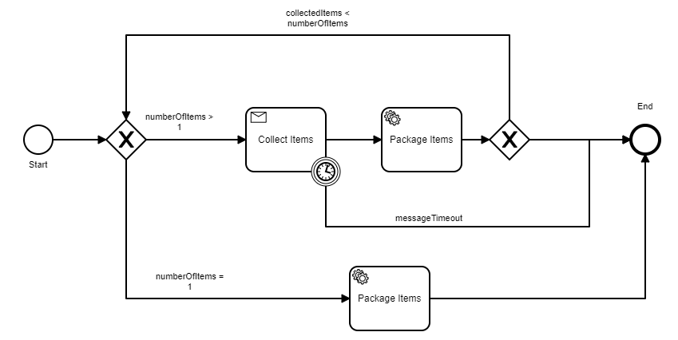

# Zeebe Message Correlation Java
This is a Java implementation of message correlation on Zeebe. This project simulates packaging multiple items in a order where order id is the unique key. Message correlation is driven through the packaging job handler of the project. This project does the followings:
* Deploy's **collect-items.bpmn** BPMN Workflow to Zeebe. 
* Correlates multiple items in a order based on order id which is the unique key.
* For multiple items data is published as message.
  * Run PackageMultipleItems from io.zeebe.message.correlation package for message correlation with 2 items
* For single item data is sent as instance variable.
  * Run PackageSingleItem from io.zeebe.message.correlation package for single item

Here's an image of a drag racer in action:

Move along.

### Build project
* mvn clean install
